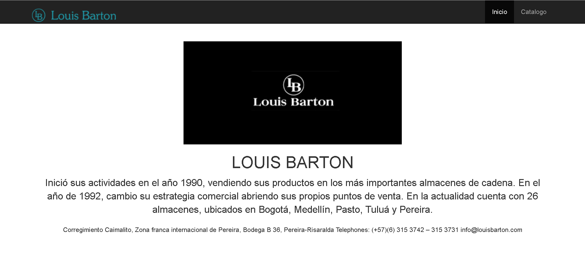
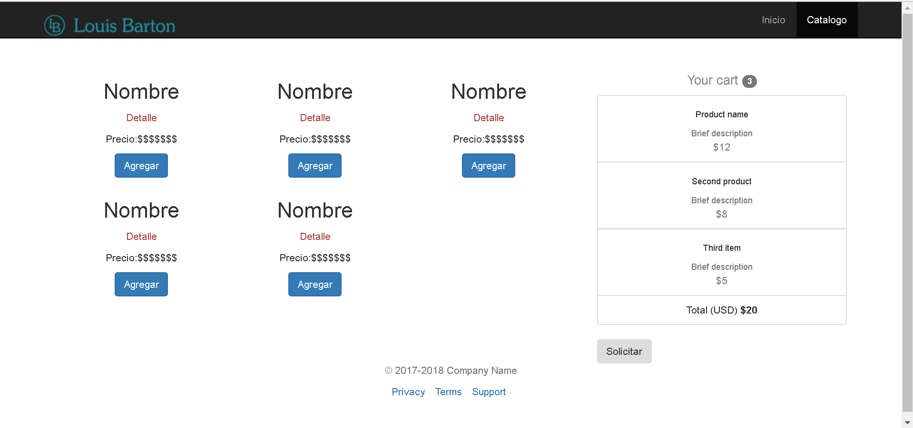
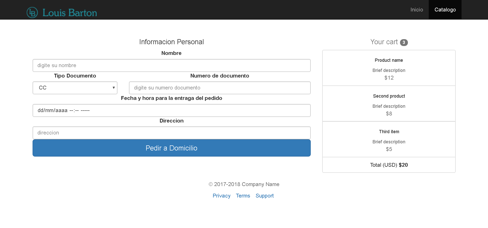

# FRONT-END

front-end: mockup que simula como se ve la aplicación contruido en html5,css3 y bootstrap

pagina inicio: index.html

  

pagina catalogo: tiene un catalo de productos y el boton solicitar que lleva al formulario de pedido

pagina catalogo

  

formulario de pedido

  

